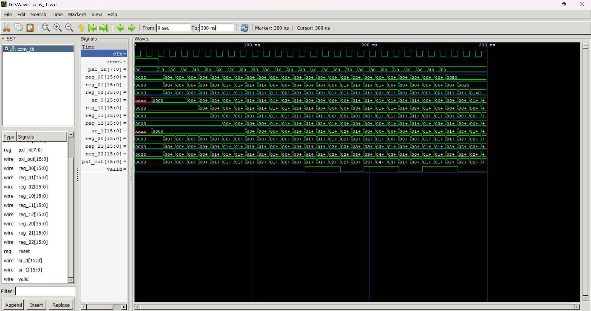

# Image Convolution and Mini 1-layer CNN in Verilog 

## Overview
This project implements a **miniature one layer Convolutional Neural Network (CNN)** in **Verilog HDL**, simulating how basic deep learning operations can be mapped to digital logic.

---

## Project Structure

| File | Description |
|------|-------------|
| `conv.v` | 3x3 Convolution module |
| `mac.v` | Multiply-Accumulate (MAC) unit |
| `shift.v`, `register.v` | Internal data movement and storage |
| `relu.v` | ReLU activation |
| `maxpool.v` | 2x2 Max Pooling layer |
| `fc.v` | Fully Connected layer (4 inputs → 1 output) |
| `input_image.txt` | 5×5 grayscale pixel input |
| `output_pixels.txt` | Output after image convolution with 3x3 kernel |
| `cnn_output.txt` | Output after CNN |
| `cnn_tb.v`, `conv_tb.v` | Testbenches |

---

## Pipeline

1. **Input image** (5×5 grayscale, text file)
2. **3x3 Convolution**
3. **ReLU Activation**
4. **2x2 MaxPooling**
5. **Fully Connected layer**
6. **Output**

---

## Tools Used

- **Verilog HDL**
- **Icarus Verilog** (Compilation)
- **GTKWave** (Waveform viewer)
- **Python (optional)** for validation

---

## How to Run Image Convolution

   ```terminal
   iverilog -o conv_tb.vvp conv_tb.v conv.v mac.v shift.v register.v
   vvp conv_tb.vvp
   gtkwave conv_tb.vcd
```
## How to Run CNN

   ```terminal
   iverilog -o cnn_tb.vvp cnn_tb.v conv.v mac.v shift.v register.v relu.v maxpool.v fc.v
   vvp cnn_tb.vvp
   gtkwave cnn_tb.vcd
```

